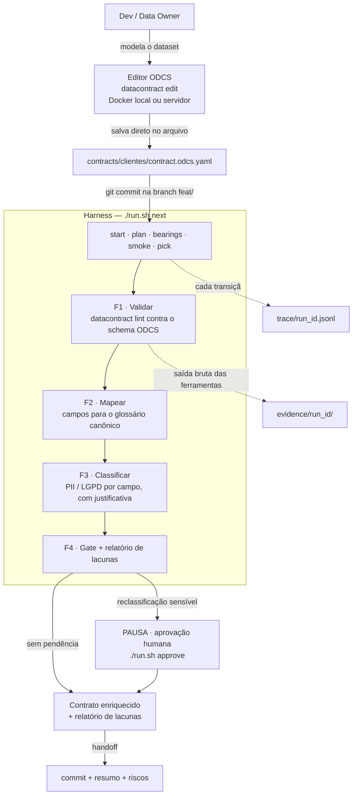
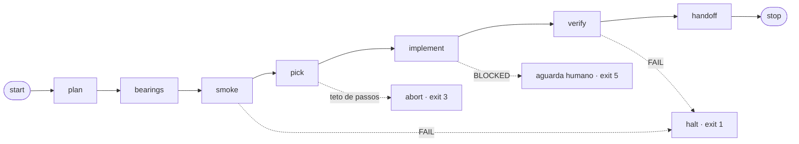

# harness-odcs

Harness de desenvolvimento incremental que conduz a **classificação de privacidade de contratos de dados ODCS** — com teto de passos, rastro auditável e ponto de controle humano.

> **Estado: completo.** As quatro features atravessam o fluxo de ponta a ponta, com medição derivada do trace. Detalhe por item em [Estado atual](#estado-atual); a leitura de onde isto se paga — e onde não — em [`docs/decisao.md`](docs/decisao.md).

---

## O problema

Uma organização que trata dados de clientes acumula **contratos de dados** — documentos que descrevem o formato, o significado e as garantias de cada dataset. Cada campo desses contratos precisa de uma resposta para uma pergunta simples e chata: *isso é dado pessoal?*

Responder na mão não escala e, pior, não deixa rastro. Três problemas concretos:

1. **Cobertura.** Um contrato com 40 campos revisado por uma pessoa cansada tem campo esquecido. Ninguém percebe até a auditoria.
2. **Justificativa.** "Esse campo é PII" sem o *porquê* registrado não serve para compliance. LGPD pede rastreabilidade da decisão, não só a decisão.
3. **Consistência.** `cpf`, `nr_cpf`, `documento` e `tax_id` são a mesma coisa. Classificados por pessoas diferentes em semanas diferentes, viram três respostas diferentes.

Jogar um LLM no problema resolve a velocidade e piora tudo o mais: ele esquece campos, reprocessa o que já fez, encerra com relatório incompleto e classifica sem justificar. **É exatamente por isso que o entregável aqui é o harness, e não o classificador.** O valor está na máquina que obriga o trabalho a ser completo, ordenado, justificado e reversível — o modelo só opina onde há ambiguidade real, e nunca decide sozinho o que é persistido.

### Onde isso se paga (e onde não)

Se paga quando há **volume de contratos e exigência de compliance**: o custo fixo do harness dilui, e o rastro é o produto. Não se paga para **um contrato único e trivial** — revisar 9 campos na mão leva 15 minutos, e isto custou 4 semanas. Esta leitura é parte da entrega, não uma ressalva; a versão completa, com os números e os limites, está em [`docs/decisao.md`](docs/decisao.md).

---

## Dois níveis

| Nível | O que é | Papel |
|---|---|---|
| **Harness** | Orquestrador em Rust: fluxo determinístico, estado persistido, trace, teto de passos, handoff em Git | **O entregável avaliado** |
| **Domínio** | Classificador de privacidade ODCS, em 4 features pequenas (F1–F4) | O "trabalho" que o harness conduz — escopo congelado |

O domínio existe para provar que a máquina anda. Se em algum momento o classificador começar a crescer e consumir o tempo do harness, o projeto falhou.

---

## Fluxo ponta a ponta


Do modelador ao contrato classificado com evidência:



O ciclo interno que cada feature atravessa, com as três saídas possíveis:



Um `FAIL` **para** no passo em que ocorreu. Não tenta a próxima fase, não contorna, não "tenta de novo com outro prompt". O contrato completo está em [`docs/spec-harness.md`](docs/spec-harness.md).

---

## Como executar

### Pré-requisitos

- Rust (toolchain fixado em `rust-toolchain.toml`)
- Docker com o engine ativo — o `datacontract-cli` roda em container
- Shell POSIX: no Windows, **git bash** (inclusive como terminal integrado do VS Code)

### Preparar o ambiente

```bash
./scripts/bootstrap.sh    # idempotente: valida toolchain, cria diretórios, puxa a imagem fixada
./run.sh doctor           # PASS/FAIL por item do ambiente
```

### Operar o harness

```bash
./run.sh plan             # monta a lista de features
./run.sh status           # onde o trabalho parou
./run.sh next             # executa a próxima feature de ponta a ponta
```

`next` é o verbo principal: escolhe a primeira feature pendente e a atravessa pelo fluxo inteiro, gravando cada transição. Você não chama fases à mão — quem decide o próximo passo é a máquina de estados. Para depurar, `--step` avança uma transição por vez e `--dry-run` mostra a sequência sem executar.

### O ponto de controle humano

Quando F4 encontra algo que o harness não tem autoridade para resolver — um campo que o glossário não cobre, ou uma classificação que contraria o que o contrato já declara —, o fluxo **para**:

```
$ ./run.sh next
  implement  BLOCKED
               gate — [lacuna] segmento — campo sem termo no glossario …
             pedido 4f773bab5f6e400f registrado em state/gate-pendente.json
bloqueado em `implement` aguardando decisao humana: 2 lacuna(s), …
$ echo $?
5
```

Nada foi escrito no contrato. Quem decide lê o pedido e libera:

```bash
./run.sh approve f4-gate    # arquiva a decisão em state/aprovacoes.json
./run.sh next               # agora atravessa e escreve o contrato enriquecido
```

**A aprovação vale para aquele conteúdo, não para a feature.** Ela é gravada pelo hash dos itens submetidos: se o contrato, o glossário ou o catálogo mudarem, o pedido é outro, o hash é outro e o gate fecha de novo. Sem isso, aprovar uma lacuna hoje liberaria em silêncio a despromoção de um campo PII amanhã.

### O mesmo julgamento, num pull request

`next` **escreve**: aplica o enriquecimento, emite o laudo, commita. Isso serve a quem está trabalhando no contrato e não serve a um pull request — três PRs abertos disputariam `state/progress.json`, e cada run de CI viraria um commit conflitando com os outros dois.

`check` responde à mesma pergunta sem nenhuma dessas consequências:

```bash
./run.sh check                      # veredito, sem escrever fora de evidence/ e trace/
./run.sh check --formato markdown   # o comentário que o PR receberia
./run.sh check --json               # o report.json, neutro de plataforma
```

Ele calcula tudo — nome, lint, mapeamento, classificação, gate, contrato enriquecido e laudo — e **não toca o contrato, não toca `state/`, não commita**. O que sairia escrito fica em `evidence/`, como proposta. E não reimplementa regra nenhuma: chama as mesmas funções que as fases chamam, para que o CI e a máquina de quem desenvolve não possam discordar sobre o mesmo contrato.

`state/aprovacoes.json` é **ignorado** aqui, de propósito: o arquivo está no repositório e quem abriu o PR pode commitá-lo, então respeitá-lo seria auto-aprovação. Num pull request, quem tem autoridade sobre o gate é a revisão de CODEOWNER — o `check` reporta a pendência e nunca a libera.

O veredito viaja no exit code: `0` passou, `1` reprovou, `5` bloqueado aguardando decisão humana. **`5` não reprova o PR** — nada está errado no contrato, falta decisão, e marcar vermelho diria a quem abriu que ele errou. Quem segura o merge é a branch protection.

O workflow em [`.github/workflows/contrato-pr.yml`](.github/workflows/contrato-pr.yml) é deliberadamente burro: chama `check`, grava o `report.json` e depois só o **redesenha** em anotação, comentário e resumo. Uma verificação, três desenhos — 99,6% do custo é partida de container, então desenhar três vezes não pode custar três verificações.

Uma branch por entrega, nascida da `main`, e o **pull request para `main` é o gatilho** — nada acontece por push direto. A convenção de nome (`<tipo>/<aaaamm>/<descrição>`) é verificada no CI e está em [`docs/git-flow.md`](docs/git-flow.md).

**Setup, portabilidade e a variante mais estrita estão em [`.github/README.md`](.github/README.md).** É lá também que está registrado o destino previsto fora desta PoC: **Azure DevOps, com grupos do Entra ID (AD) como aprovadores** por política de branch. A porta custa um renderizador e um YAML — a política, os exit codes e o `report.json` não se movem.

---

## Medição

```bash
./run.sh metrics
```

Deriva custo, duração, erros e resultado **de `trace/`** e regenera `metrics/metrics.jsonl`. Não há contador paralelo: `duration_ms` e `exit_code` estão no trace desde o primeiro dia justamente para que a métrica nascesse daqui. Apagar `metrics/` não perde nada.

### A leitura honesta — 14 runs

| | |
|---|---|
| Runs | 14 — 10 `PASS`, 4 `HALT` |
| Duração somada | 81,5 s |
| Em ferramenta externa | 81,1 s — **99,6%**, em 153 invocações |
| Fase mais cara | `verify` (20,2 s somados) |
| Erros | 1 fase reprovada · 2 bloqueios · 2 abortos |

**Onde saiu caro: em lugar nenhum que o harness controle.** 99,6% do tempo é espera de processo externo — `docker run` do `datacontract-cli`, a ~530 ms de partida por invocação. A máquina de estados, o trace, a leitura do glossário e a classificação inteira somam os 0,4% restantes. Duas consequências que valem mais que o número:

- **Otimizar o harness não paga.** O ganho possível está em reduzir invocações de container, não em código Rust.
- **O custo escala com invocações, não com campos.** Classificar 9 campos ou 90 custa praticamente o mesmo; rodar o fluxo duas vezes custa o dobro. É o que sustenta a leitura de que o harness se paga com volume de contratos.

Não há custo de token: nenhum modelo roda dentro do fluxo. A classificação é consulta a catálogo, determinística.

**Onde travou** — os três desfechos de parada previstos na spec aconteceram de verdade, cada um uma vez:

| Run | Parada | Exit |
|---|---|---|
| `…033351Z-ad8cec` | teto de 4 passos atingido em `smoke` | `3` |
| `…041954Z-a69d54` | `FAIL` em `verify` — `logicalType` inválido no contrato | `1` |
| `…031348Z-11391c` | bloqueado em `implement` — 2 lacunas aguardando decisão humana | `5` |
| `…033311Z-ed5ef8` | bloqueado em `implement` — reclassificação de `data_cadastro` | `5` |

O teto de passos não é demonstrável só em teste: **está no registro**. O run `ad8cec` rodou com `max_steps: 4` e abortou em `smoke`, como a tabela de decisão manda — e é por isso que o teto mora em `progress.json`, ajustável sem recompilar.

O último run é o ensaio da demo, e vale por um motivo específico: o catálogo baixou `cadastro.data_criacao` de `internal` para `confidential`, o gate abriu com hash `4ada9f54`, e a aprovação anterior — `4f773bab`, das duas lacunas — **não liberou nada**. A aprovação vale para um conteúdo, e isso está no registro, não só no teste.

Limites do que está medido, ditos em voz alta: a duração é a **soma das fases**, não relógio de parede — fica de fora a escrita de estado entre fases, sub-milissegundo. E `erros` conta fase reprovada, nunca exit code diferente de zero: o fluxo pergunta ao git se uma branch existe, e o exit `1` dessa sondagem é a resposta "não existe", não uma falha. As duas contagens são campos separados no `metrics.jsonl`.

---

## Editor de contratos ODCS

Há **dois modos**, e resolvem problemas diferentes. Ambos verificados nesta máquina.

### Modo 1 · Editor pessoal, ligado ao arquivo do repositório

`datacontract edit` sobe um servidor local, serve a interface e **escreve direto no `.yaml` do repositório**. É o modo de quem está trabalhando naquele contrato: o "salvar" do editor vira linha no `git diff`.

```bash
docker run --rm \
  -p 4243:4243 \
  -v "$PWD:/home/datacontract" \
  datacontract/cli:1.1.0 \
  edit contracts/clientes/contract.odcs.yaml --host 0.0.0.0 --no-open
```

Acesse **http://localhost:4243**.

Três detalhes que importam:

- `--host 0.0.0.0` é obrigatório em container. O default é `127.0.0.1`, que escuta só no loopback de dentro do container — a porta publicada não alcançaria nada.
- `--no-open` porque não há navegador dentro do container para abrir. O default é abrir.
- O mount `-v "$PWD:/home/datacontract"` é o que faz o "salvar" do editor cair no arquivo do seu repositório.

A porta default é **4243**. Os assets do editor vêm empacotados no CLI e **funcionam offline** — `--editor-version` e `--editor-assets-url` só entram se você quiser carregar de um CDN ou de um build próprio.

No projeto isso fica encapsulado em `./scripts/editor.sh <contrato>`.

Sem container, com o CLI instalado na máquina: `datacontract edit contracts/clientes/contract.odcs.yaml`.

### Modo 2 · Editor compartilhado da organização — **recomendado para uso corporativo**

Imagem standalone [`datacontract/editor`](https://hub.docker.com/r/datacontract/editor) ([código](https://github.com/datacontract/datacontract-editor)): 22 MB, nginx servindo uma aplicação estática.

```bash
docker run -d --name odcs-editor -p 8080:4173 datacontract/editor:latest
```

Acesse **http://localhost:8080**, ou o host do servidor.

> **A porta interna é 4173, não 80.** A imagem expõe as duas, mas o nginx escuta só na 4173 — mapear `8080:80` sobe o container e não responde nada.

**A interface é a mesma. O que muda é a plumbing** — e é ela que decide o uso corporativo:

| | Modo 1 · `datacontract edit` | Modo 2 · `datacontract/editor` |
|---|---|---|
| Quem consegue usar | quem tem o repo na máquina | qualquer pessoa, só com o link |
| Salvar | escreve no arquivo do repo | baixa o `.yaml` |
| Estado no servidor | monta **um** repo, edita **um** arquivo | nenhum — roda no browser |
| Multiusuário | não isola: todos editariam o mesmo arquivo | cada um na sua aba |
| Instalação para o usuário | Docker + repo + mount | nenhuma |
| Rodar testes | embutido | só apontando `TESTS_SERVER_URL` para um `datacontract api` |

O Modo 1 **não tem como** ser o editor da organização: ele monta o repositório de uma pessoa e escreve num arquivo fixo. Publicado para o time, viraria todo mundo editando o mesmo arquivo, sem isolamento e sem histórico de quem mexeu.

Papéis no fluxo: o Modo 2 é onde o contrato **nasce ou é proposto** — a pessoa modela, baixa o YAML e ele entra no repositório por commit ou PR, que é onde o harness assume. O Modo 1 é a ferramenta de quem já está com o contrato em mãos, ajustando dentro do repo.

Para uma implantação corporativa completa, suba junto um `datacontract api` e aponte `TESTS_SERVER_URL` para ele — assim o botão "Run test" do editor funciona sem que ninguém instale o CLI.

> **Segurança, antes de publicar internamente.**
> **Nenhum dos dois modos tem autenticação.** Publicar em rede expõe a quem alcançar a porta: use rede interna, VPN ou proxy reverso com SSO.
> A imagem do Modo 2 aceita `AI_ENABLED`, `AI_PROVIDER`, `AI_ENDPOINT`, `AI_API_KEY` e `AI_MODEL`. Ligar isso envia o conteúdo do contrato a um provedor externo de LLM e coloca uma chave em variável de ambiente — as duas coisas colidem com as restrições deste projeto. O default é `"enabled":false`, confirmado no `config.json` servido pela imagem. Mantenha assim.

---

## Padrões e referências

| Link | O que é |
|---|---|
| [github.com/bitol-io](https://github.com/bitol-io) | Projeto **Bitol** (LF AI & Data), que mantém o **ODCS — Open Data Contract Standard**. É o padrão que os contratos deste projeto seguem e contra o qual são validados. |
| [datacontract.com](https://datacontract.com/) | Especificação e ecossistema de data contracts — origem do `datacontract-cli` e do editor usados aqui como motor de validação e de modelagem. |
| [datacontract-cli](https://github.com/datacontract/datacontract-cli) | A ferramenta em si: `lint`, `test`, `edit`, exportadores. Usada em container, fixada em **1.1.0** (nunca `:latest`). |

**A validação ODCS não é reimplementada em Rust.** O `datacontract-cli` é o motor; o harness é quem o invoca, mede, registra e decide o que fazer com o resultado.

---

## Restrições do projeto

Herdadas de [`docs/contexto.md`](docs/contexto.md) e válidas para todo o código:

- **Dados sintéticos apenas.** Nada real, nada de produção.
- **O agente atua sobre metadados**, nunca sobre os dados. Nenhum valor de campo classificado como PII sai — o trace guarda nome de campo, decisão e justificativa; a saída bruta das ferramentas fica em `evidence/`.
- **Reclassificação sensível exige aprovação humana** antes de valer. O fluxo pausa; não decide sozinho.
- **Sem escrita direta na `main`.** Branch por feature, commit no handoff.
- **Nenhum segredo persistido** em artefato.
- **Sem rede externa além do necessário.** O editor local e a validação rodam offline.
- **Nada rodando permanentemente.** Execução curta, com teto de passos; estourou, para e escala para revisão humana.

---

## Quando usar, e quando não

A leitura completa está em [`docs/decisao.md`](docs/decisao.md). O resumo:

| | |
|---|---|
| **Use** | Volume de contratos · rastreabilidade é requisito · o vocabulário tem dono |
| **Não use** | Um contrato único e trivial · domínio sem vocabulário estável · ninguém responde pelo glossário |

A pergunta que separa os dois casos não é *"quantos contratos você tem?"* — é **"alguém vai ter que provar, depois, por que este campo foi classificado assim?"**. Se a resposta for não, este harness é caro demais, e um checklist no template do PR resolve melhor.

Três limites que valem saber antes de adotar: **22% dos campos** saíram como lacuna no primeiro contrato real (a cobertura é do glossário, não da ferramenta); propriedades ODCS aninhadas não foram exercitadas; e a reescrita do contrato perde comentários do YAML.

---

## Estado atual

Semana 4 de 4. As quatro features rodam de ponta a ponta, a medição é derivada do trace e o pacote de entrega está fechado.

| Item | Estado |
|---|---|
| `docs/brief.md` — plano das 4 semanas | pronto |
| `docs/contexto.md` — mapa de restrições | pronto |
| `docs/spec-harness.md` — contrato congelado do harness (v4) | pronto |
| `run.sh`, `flow.rs`, `state/`, `trace/`, `scripts/` | pronto · 82 testes |
| F1 · Validar — [spec](docs/spec-f1-validar.md) | pronta · lint ODCS + relatório HTML |
| F2 · Mapear — [spec](docs/spec-f2-mapear.md) | pronta · glossário canônico, cobertura de decisão |
| F3 · Classificar — [spec](docs/spec-f3-classificar.md) | pronta · catálogo LGPD em campos ODCS |
| F4 · Gate + relatório — [spec](docs/spec-f4-gate.md) | pronta · contrato enriquecido, lacunas e pausa humana |
| F5 · Cobertura aninhada — [spec](docs/spec-f5-aninhado.md) | pronta · objeto e array percorridos, `classification` na folha |
| F6 · Divergência preservada — [spec](docs/spec-f6-divergencia.md) | pronta · o harness deixa de escolher lado numa contradição |
| Medição (custo, duração, erros) | pronta · `./run.sh metrics`, derivada do trace |
| Verificação em pull request — [`.github/`](.github/README.md) | pronta · `./run.sh check`, workflow e CODEOWNERS |
| [`docs/git-flow.md`](docs/git-flow.md) — branch, PR e merge | pronto · convenção verificada no CI |
| [`docs/distribuicao.md`](docs/distribuicao.md) — o pacote que sai daqui | pronto · `./scripts/package.sh`, release por tag |
| [`docs/curso.md`](docs/curso.md) — o checklist do curso e o que ficou subutilizado | pronto |
| [`docs/processo.md`](docs/processo.md) — o fluxo de produção, ponta a ponta | pronto |
| [`docs/artefatos.md`](docs/artefatos.md) — pacote, container e tudo que é gerado | pronto |
| [`docs/laudo.md`](docs/laudo.md) — como o laudo nasce e o que o sustenta | pronto |
| [`docs/cobertura.md`](docs/cobertura.md) — o limite aninhado: medido, e resolvido em F5 | fechado |
| [`docs/portabilidade.md`](docs/portabilidade.md) — a prova, e o que ela custou | pronto |
| [`docs/bootstrap-repo-contratos.md`](docs/bootstrap-repo-contratos.md) — criar o repo de contratos do zero | pronto |
| [`BACKLOG-FUTURO.md`](BACKLOG-FUTURO.md) — o que ficou de fora, e por quê | pronto |
| `templates/repo-de-contratos/` — workflow, CODEOWNERS, PR template, Azure pipeline | pronto |
| Repositório de contratos consumindo o pacote | [`andrelaf/data-contracts`](https://github.com/andrelaf/data-contracts) · sem Rust, sem vocabulário |
| Azure DevOps com grupos do AD como aprovadores | **previsto, não construído** · porta descrita em [`.github/README.md`](.github/README.md#portar-para-azure-devops) |
| [`docs/decisao.md`](docs/decisao.md) — onde se paga e onde perde | pronto |
| [`docs/demo.md`](docs/demo.md) — roteiro ensaiado, 10 min | pronto |

### Pacote mínimo — onde cada item está

| Item | Onde |
|---|---|
| README: problema, restrições, arquitetura, como executar | este arquivo |
| Ponto de entrada estável | [`run.sh`](run.sh) — único, sem alternativa documentada |
| Estado e backlog persistidos | `state/feature-list.json`, `state/progress.json` |
| Smoke test e verificação com PASS/FAIL explícito | fases `smoke` e `verify`; `./run.sh doctor` usa o mesmo código |
| Handoff por feature: commit, resumo, testes, riscos | fase `handoff` + histórico do Git |
| Trace da trajetória | `trace/<run_id>.jsonl`, append-only |
| Medição: custo, duração, erros, resultado | `metrics/metrics.jsonl` · `./run.sh metrics` |
| Recomendação: quando usar e quando não | [`docs/decisao.md`](docs/decisao.md) e a seção acima |

### Saída para máquina

```bash
./run.sh status --json     # progresso e lista de features
./run.sh doctor --json     # PASS/FAIL por item de ambiente
./run.sh metrics --json    # runs e resumo, sem abrir o arquivo
./run.sh check --json      # o veredito do contrato — é o que o CI consome
./run.sh report <arquivo> --json
```

Vale para os comandos cuja saída **é** relatório. Nos que mutam estado (`next`, `approve`, `reset`) a flag é **recusada com exit `2`** — a saída deles é narrativa de progresso, não dado, e uma flag silenciosamente sem efeito engana mais que uma recusa. O exit code continua sendo o veredito nos dois formatos.

O `report.json` do `check` tem `schema_version` próprio e é o ponto de integração estável: é dele que saem as anotações, o comentário do PR e o resumo do job, e é ele que outro CI leria sem precisar de expressão regular sobre texto de console.

## Estrutura do repositório

A leitura por audiência: **quem vai usar** o processo começa por
[`docs/processo.md`](docs/processo.md); **quem vai montar** um repositório de
contratos, por [`docs/bootstrap-repo-contratos.md`](docs/bootstrap-repo-contratos.md);
**quem avalia o trabalho de curso**, por [`docs/curso.md`](docs/curso.md).

```
run.sh                    ponto de entrada único
.github/                  verificação em pull request — workflow, CODEOWNERS e o guia de setup
scripts/                  ambiente, empacotamento e o gerador do repo de contratos
src/                      o harness em Rust — fluxo, estado, trace, fases
tests/                    tabela de transições: ordem, teto, halt
contracts/<nome>/         um diretório por contrato — fonte, e destino do enriquecimento aprovado
glossary/                 o glossário canônico contra o qual os campos são lidos
classification/           o catálogo LGPD, chaveado por termo do glossário
state/                    feature-list.json, progress.json, gate-pendente.json, aprovacoes.json
trace/                    <run_id>.jsonl, append-only
metrics/                  metrics.jsonl — derivado de trace/, regenerável
evidence/                 saída bruta das ferramentas — runs representativos, não todos
docs/                     brief, contexto, specs, processo, laudo, cobertura, decisão e demo
templates/                o repositório de contratos inteiro, pronto para materializar
```

`evidence/` guarda **runs representativos**, não os 39 que existiram: a evidência
é regenerável a partir do contrato e do critério, e 445 arquivos de saída bruta
afogavam os 19 do produto. O `trace/` ficou inteiro — é dele que a medição é
derivada, e apagá-lo tornaria os números da [Medição](#medição) não verificáveis.

O histórico do Git preserva o que foi podado.
