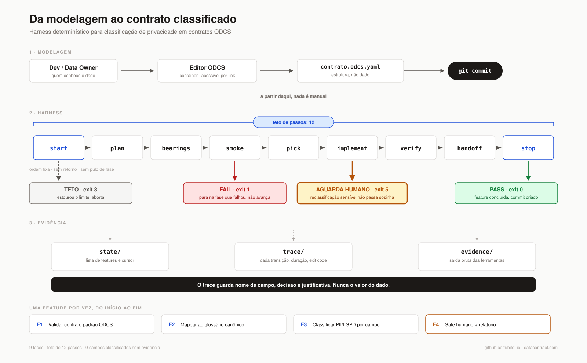
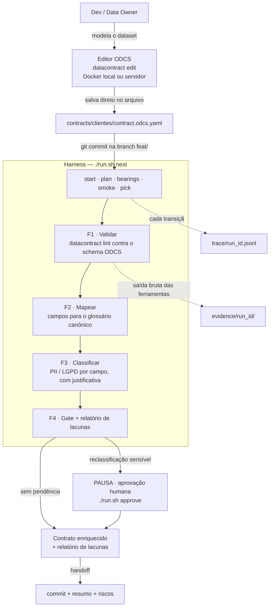

# harness-odcs

Harness de desenvolvimento incremental que conduz a **classificação de privacidade de contratos de dados ODCS** — com teto de passos, rastro auditável e ponto de controle humano.

> **Estado: Semana 1, em construção.** Este README descreve a arquitetura alvo. O que já existe está marcado em [Estado atual](#estado-atual).

---

## O problema

Uma organização que trata dados de clientes acumula **contratos de dados** — documentos que descrevem o formato, o significado e as garantias de cada dataset. Cada campo desses contratos precisa de uma resposta para uma pergunta simples e chata: *isso é dado pessoal?*

Responder na mão não escala e, pior, não deixa rastro. Três problemas concretos:

1. **Cobertura.** Um contrato com 40 campos revisado por uma pessoa cansada tem campo esquecido. Ninguém percebe até a auditoria.
2. **Justificativa.** "Esse campo é PII" sem o *porquê* registrado não serve para compliance. LGPD pede rastreabilidade da decisão, não só a decisão.
3. **Consistência.** `cpf`, `nr_cpf`, `documento` e `tax_id` são a mesma coisa. Classificados por pessoas diferentes em semanas diferentes, viram três respostas diferentes.

Jogar um LLM no problema resolve a velocidade e piora tudo o mais: ele esquece campos, reprocessa o que já fez, encerra com relatório incompleto e classifica sem justificar. **É exatamente por isso que o entregável aqui é o harness, e não o classificador.** O valor está na máquina que obriga o trabalho a ser completo, ordenado, justificado e reversível — o modelo só opina onde há ambiguidade real, e nunca decide sozinho o que é persistido.

### Onde isso se paga (e onde não)

Se paga quando há **volume de contratos e exigência de compliance**: o custo fixo do harness dilui, e o rastro é o produto. Não se paga para **um contrato único e trivial** — revisar 8 campos na mão é mais rápido do que operar qualquer máquina. Esta leitura é parte da entrega, não uma ressalva.

---

## Dois níveis

| Nível | O que é | Papel |
|---|---|---|
| **Harness** | Orquestrador em Rust: fluxo determinístico, estado persistido, trace, teto de passos, handoff em Git | **O entregável avaliado** |
| **Domínio** | Classificador de privacidade ODCS, em 4 features pequenas (F1–F4) | O "trabalho" que o harness conduz — escopo congelado |

O domínio existe para provar que a máquina anda. Se em algum momento o classificador começar a crescer e consumir o tempo do harness, o projeto falhou.

---

## Fluxo ponta a ponta



Do modelador ao contrato classificado com evidência:



O ciclo interno que cada feature atravessa, com as três saídas possíveis:


Um `FAIL` **para** no passo em que ocorreu. Não tenta a próxima fase, não contorna, não "tenta de novo com outro prompt". O contrato completo está em [`docs/spec-harness.md`](docs/spec-harness.md).

---

## Como executar

### Pré-requisitos

- Rust (toolchain fixado em `rust-toolchain.toml`)
- Docker com o engine ativo — o `datacontract-cli` roda em container
- Shell POSIX: no Windows, **git bash** (inclusive como terminal integrado do VS Code)

### Preparar o ambiente

```bash
./scripts/bootstrap.sh    # idempotente: valida toolchain, cria diretórios, puxa a imagem fixada
./run.sh doctor           # PASS/FAIL por item do ambiente
```

### Operar o harness

```bash
./run.sh plan             # monta a lista de features
./run.sh status           # onde o trabalho parou
./run.sh next             # executa a próxima feature de ponta a ponta
```

`next` é o verbo principal: escolhe a primeira feature pendente e a atravessa pelo fluxo inteiro, gravando cada transição. Você não chama fases à mão — quem decide o próximo passo é a máquina de estados. Para depurar, `--step` avança uma transição por vez e `--dry-run` mostra a sequência sem executar.

---

## Editor de contratos ODCS

Há **dois modos**, e resolvem problemas diferentes. Ambos verificados nesta máquina.

### Modo 1 · Editor pessoal, ligado ao arquivo do repositório

`datacontract edit` sobe um servidor local, serve a interface e **escreve direto no `.yaml` do repositório**. É o modo de quem está trabalhando naquele contrato: o "salvar" do editor vira linha no `git diff`.

```bash
docker run --rm \
  -p 4243:4243 \
  -v "$PWD:/home/datacontract" \
  datacontract/cli:1.1.0 \
  edit contracts/clientes/contract.odcs.yaml --host 0.0.0.0 --no-open
```

Acesse **http://localhost:4243**.

Três detalhes que importam:

- `--host 0.0.0.0` é obrigatório em container. O default é `127.0.0.1`, que escuta só no loopback de dentro do container — a porta publicada não alcançaria nada.
- `--no-open` porque não há navegador dentro do container para abrir. O default é abrir.
- O mount `-v "$PWD:/home/datacontract"` é o que faz o "salvar" do editor cair no arquivo do seu repositório.

A porta default é **4243**. Os assets do editor vêm empacotados no CLI e **funcionam offline** — `--editor-version` e `--editor-assets-url` só entram se você quiser carregar de um CDN ou de um build próprio.

No projeto isso fica encapsulado em `./scripts/editor.sh <contrato>`.

Sem container, com o CLI instalado na máquina: `datacontract edit contracts/clientes/contract.odcs.yaml`.

### Modo 2 · Editor compartilhado da organização — **recomendado para uso corporativo**

Imagem standalone [`datacontract/editor`](https://hub.docker.com/r/datacontract/editor) ([código](https://github.com/datacontract/datacontract-editor)): 22 MB, nginx servindo uma aplicação estática.

```bash
docker run -d --name odcs-editor -p 8080:4173 datacontract/editor:latest
```

Acesse **http://localhost:8080**, ou o host do servidor.

> **A porta interna é 4173, não 80.** A imagem expõe as duas, mas o nginx escuta só na 4173 — mapear `8080:80` sobe o container e não responde nada.

**A interface é a mesma. O que muda é a plumbing** — e é ela que decide o uso corporativo:

| | Modo 1 · `datacontract edit` | Modo 2 · `datacontract/editor` |
|---|---|---|
| Quem consegue usar | quem tem o repo na máquina | qualquer pessoa, só com o link |
| Salvar | escreve no arquivo do repo | baixa o `.yaml` |
| Estado no servidor | monta **um** repo, edita **um** arquivo | nenhum — roda no browser |
| Multiusuário | não isola: todos editariam o mesmo arquivo | cada um na sua aba |
| Instalação para o usuário | Docker + repo + mount | nenhuma |
| Rodar testes | embutido | só apontando `TESTS_SERVER_URL` para um `datacontract api` |

O Modo 1 **não tem como** ser o editor da organização: ele monta o repositório de uma pessoa e escreve num arquivo fixo. Publicado para o time, viraria todo mundo editando o mesmo arquivo, sem isolamento e sem histórico de quem mexeu.

Papéis no fluxo: o Modo 2 é onde o contrato **nasce ou é proposto** — a pessoa modela, baixa o YAML e ele entra no repositório por commit ou PR, que é onde o harness assume. O Modo 1 é a ferramenta de quem já está com o contrato em mãos, ajustando dentro do repo.

Para uma implantação corporativa completa, suba junto um `datacontract api` e aponte `TESTS_SERVER_URL` para ele — assim o botão "Run test" do editor funciona sem que ninguém instale o CLI.

> **Segurança, antes de publicar internamente.**
> **Nenhum dos dois modos tem autenticação.** Publicar em rede expõe a quem alcançar a porta: use rede interna, VPN ou proxy reverso com SSO.
> A imagem do Modo 2 aceita `AI_ENABLED`, `AI_PROVIDER`, `AI_ENDPOINT`, `AI_API_KEY` e `AI_MODEL`. Ligar isso envia o conteúdo do contrato a um provedor externo de LLM e coloca uma chave em variável de ambiente — as duas coisas colidem com as restrições deste projeto. O default é `"enabled":false`, confirmado no `config.json` servido pela imagem. Mantenha assim.

---

## Padrões e referências

| Link | O que é |
|---|---|
| [github.com/bitol-io](https://github.com/bitol-io) | Projeto **Bitol** (LF AI & Data), que mantém o **ODCS — Open Data Contract Standard**. É o padrão que os contratos deste projeto seguem e contra o qual são validados. |
| [datacontract.com](https://datacontract.com/) | Especificação e ecossistema de data contracts — origem do `datacontract-cli` e do editor usados aqui como motor de validação e de modelagem. |
| [datacontract-cli](https://github.com/datacontract/datacontract-cli) | A ferramenta em si: `lint`, `test`, `edit`, exportadores. Usada em container, fixada em **1.1.0** (nunca `:latest`). |

**A validação ODCS não é reimplementada em Rust.** O `datacontract-cli` é o motor; o harness é quem o invoca, mede, registra e decide o que fazer com o resultado.

---

## Restrições do projeto

Herdadas de [`docs/contexto.md`](docs/contexto.md) e válidas para todo o código:

- **Dados sintéticos apenas.** Nada real, nada de produção.
- **O agente atua sobre metadados**, nunca sobre os dados. Nenhum valor de campo classificado como PII sai — o trace guarda nome de campo, decisão e justificativa; a saída bruta das ferramentas fica em `evidence/`.
- **Reclassificação sensível exige aprovação humana** antes de valer. O fluxo pausa; não decide sozinho.
- **Sem escrita direta na `main`.** Branch por feature, commit no handoff.
- **Nenhum segredo persistido** em artefato.
- **Sem rede externa além do necessário.** O editor local e a validação rodam offline.
- **Nada rodando permanentemente.** Execução curta, com teto de passos; estourou, para e escala para revisão humana.

---

## Estado atual

Semana 1 de 4. O objetivo é o esqueleto rodando **uma** feature de ponta a ponta com o primeiro trace.

| Item | Estado |
|---|---|
| `docs/brief.md` — plano das 4 semanas | pronto |
| `docs/contexto.md` — mapa de restrições | pronto |
| `docs/spec-harness.md` — contrato congelado do harness | pronto |
| `run.sh`, `flow.rs`, `state/`, `trace/`, `scripts/` | **em construção** |
| F1 · Validar — [spec](docs/spec-f1-validar.md) | pronta · lint ODCS + relatório HTML |
| F2 · Mapear — [spec](docs/spec-f2-mapear.md) | pronta · glossário canônico, cobertura de decisão |
| F3 · Classificar | Semana 2 |
| F4 · Gate + relatório | Semana 3 |
| Medição (custo, duração, erros) | Semana 3 |
| README de decisão + demo | Semana 4 |

## Estrutura do repositório

```
run.sh                    ponto de entrada único
scripts/                  despachantes de ambiente (bootstrap, doctor, editor, ci)
src/                      o harness em Rust — fluxo, estado, trace, fases
tests/                    tabela de transições: ordem, teto, halt
contracts/<nome>/         um diretório por contrato — só fonte, nada gerado
glossary/                 o glossário canônico contra o qual os campos são lidos
state/                    feature-list.json, progress.json
trace/                    <run_id>.jsonl, append-only
evidence/                 saída bruta das ferramentas, por run
docs/                     brief, contexto, spec
```
